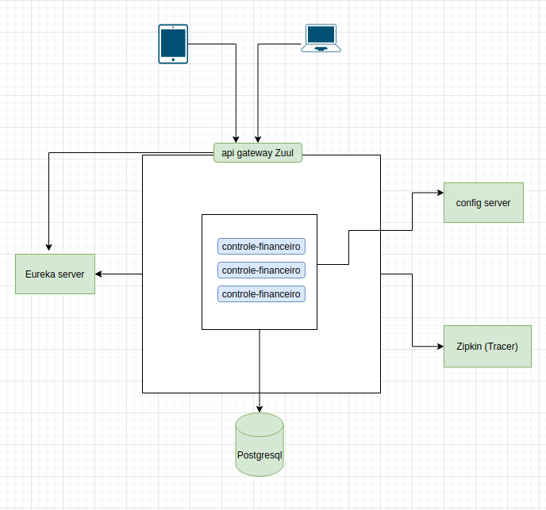

# controle-financeiro
Serviço que controla lançamento de receitas e despesas.<br>

## Logs
- [Zipkin](http://localhost:9411/zipkin/)

# Instruções para Desenvolvimento

## Tecnologias
+ [Java 11](https://openjdk.java.net/projects/jdk/11/)
+ [Gradle 6](https://docs.gradle.org/6.5.1/userguide/userguide.html)
+ [Spring-Boot 2.5.5.RELEASE](https://docs.spring.io/spring-boot/docs/2.5.5.RELEASE/reference/html/)
+ [Spring Cloud](https://docs.spring.io/spring-cloud/docs/2020.0.0/reference/html/)
+ [Flyway 6.5.5](https://flywaydb.org/documentation/)
+ [Lombok](https://projectlombok.org/)
+ [Spring Cloud Eureka](https://cloud.spring.io/spring-cloud-netflix/reference/html/)
+ [Spring Cloud Gateway](https://spring.io/projects/spring-cloud-gateway)
+ [Spring Cloud Sleuth](https://spring.io/projects/spring-cloud-sleuth)

## Código fonte
Todos os arquivos do projeto utilizam encoding UTF-8.
Utilizamos a IDE [Intellij](https://www.jetbrains.com/pt-br/idea/) para desenvolvimento.

## Lombok
Este projeto utiliza o [Lombok](https://projectlombok.org/) em VOs, Entity e objetos que serão serializados, e [MapStruct](https://mapstruct.org/) para conversão entre POJOs.

Instale o plugin do lombok e map-struct no IntelliJ de acordo com as Instruções:
- Habilite o plugin em Settings > File > Example
- Habilite a opção **annotation processors** em Settings > File >

## Rodando localmente
Para rodar a aplicação em sua máquina siga os passos:
- Cria a network
   ```
   docker network create controle-financeiro-net
   ```
- Configurando o banco de dados
   ```
     docker pull postgres:12-alpine
     docker run -p 5432:5432 --name controle-financeiro-bd --network controle-financeiro-net -e POSTGRES_PASSWORD=123456 -e POSTGRES_DB=controle-financeiro postgres:12-alpine
   ```
- Cria o container do zipkin
   ```
    docker run -itd --name controle-financeiro-trace -p 9411:9411 --network controle-financeiro-net openzipkin/zipkin
   ```

- Cria o container do projeto
   ```
    docker build -t controle-financeiro:v1 .
    docker run -p 8080:8080 --network controle-financeiro-net controle-financeiro:v1
   ```
## SWAGGER
+ [Swagger-Local](http://localhost:8080/swagger-ui/index.html#/)
## Desenho arquitetura



---
> Desenvolvido por Ednaldo Franco.

